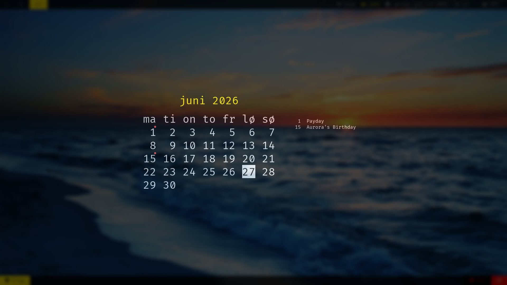

# xcalendar



## Description

xcalendar is a simple X11 program that lets you navigate through the calendar
and shows your recurring events (birthdays, anniversaries and other important
dates).

For usage instructions, check:

```sh
$ man xcalendar
```

## Dependencies

To run xcalendar, you need the following libraries installed: libxcb, libxcb-image, libxcb-keysyms, libxkbcommon, libfreetype2, libfontconfig, libgrapheme and libcalrepeat

## Building and installing

```sh
$ make
$ sudo make PREFIX=/usr install
```

## License

Code is licensed under GNU's General Public License v2. See `COPYING` for details.
